# Comandos del 21-25

## Comando chmod
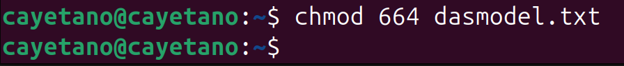

Significado de los números
| num | descripción |
| -- | -- |
| 0 |ningún permiso|
| 1 |ejecución|
| 2 |escritura|
| 3 |escritura + ejecución|
| 4 |lectura|
| 5 |lectura + ejecución|
| 6 |lectura + escritura|
| 7 |lectura + escritura + ejecución|

Posición de los números
| A | B | C|
| --|--|--|
| Permisos para el propietario | Permisos para el grupo | Otros |

## Comando kill
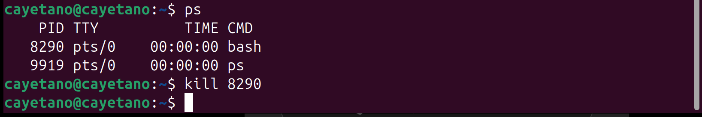
Requiere número de proceso

## Comando ping
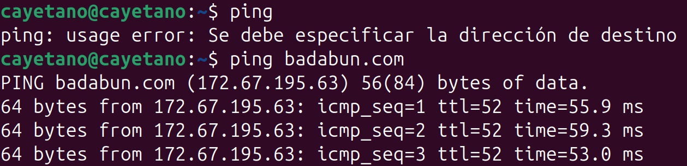
Requiere dirección IP o URL de página web

## Comando wget
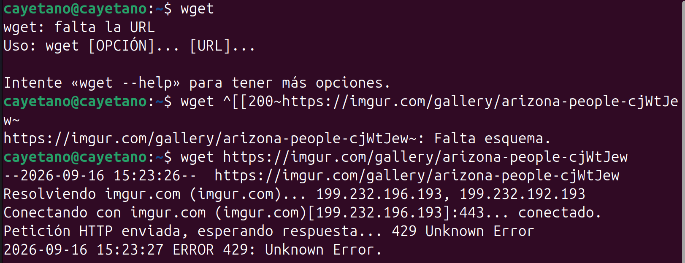
Requiere dirección URL de la imagen

## Comando grep

### Hallar palabra
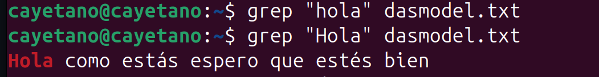

### Hallar palabra ignorando mayusculas
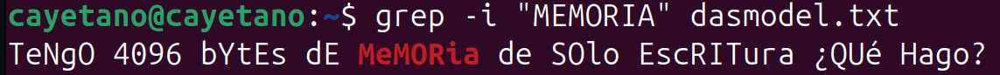

### En que lineas no esta la palabra a ubscar (búsqueda invertida)
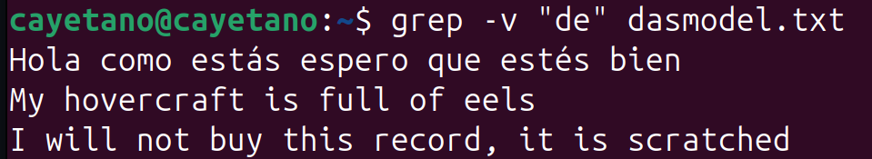

### Ubicar líneas en la que aparece la palabra
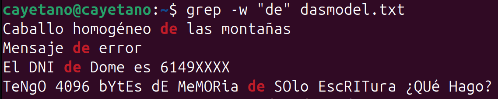

### Ubicar el número de línea en la que aparece la palabra
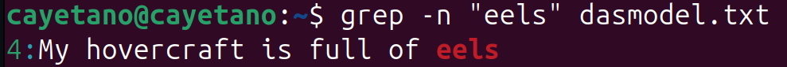

### Buscar la palabra en múltiples archicos de una misma extensión
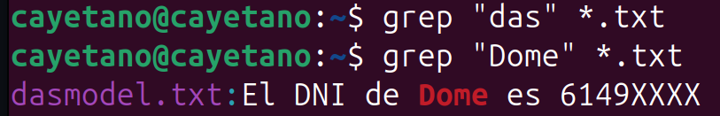

### Buscar solo la palabra completa
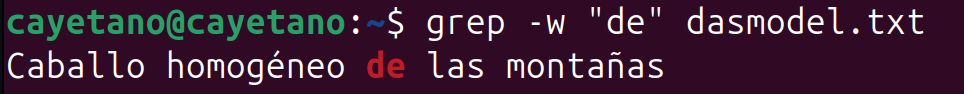
